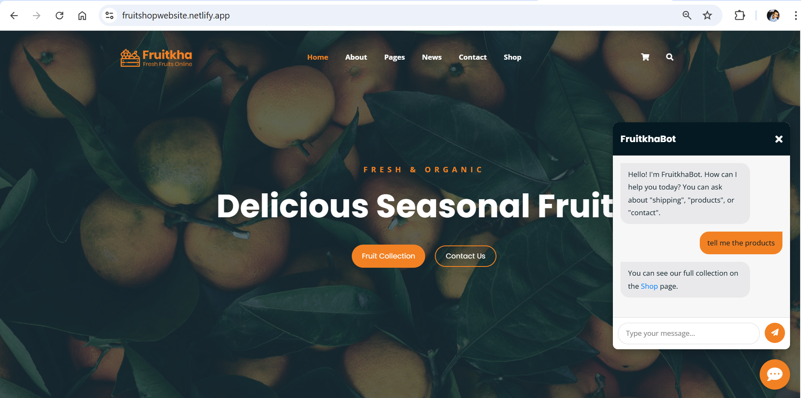

**# Fruitkha - Fruit Shop Website**

Fruitkha is a responsive, multi-page e-commerce website template designed for a fruit shop. It features a clean, modern design and is built with standard web technologies. The project includes a variety of pages and interactive elements to create a complete user experience.

A key feature of this project is a custom-coded, rule-based **AI Chatbot** to assist users with common questions.

---

## 📸 Fruitkha Homepage



---

## 🌐 Live Demo

[- 🔗 Click here to view the live site on Netlify](https://fruitshopwebsite.netlify.app)

[- 🔗 Click here to view the live site on GitHub Pages](https://riteshraut0116.github.io/fruit_shop_website_html/)

---

## ✨ Features

- **Fully Responsive Design:** Looks great on all devices, from mobile phones to desktops.
- **Multi-Page Layout:** Includes pages for Home, About, Shop, News, Contact, Cart, and more.
- **Interactive Homepage:** Features a hero banner, product showcases, promotional sections, and customer testimonials.
- **Product Filtering:** The shop page uses Isotope.js for smooth, animated filtering of products by category.
- **AI Chatbot:** A custom-built chatbot (using HTML, CSS, and jQuery) that responds to user queries about shipping, products, and contact info.
- **Dynamic Countdown Timer:** A "Deal of the Month" section with a live countdown.
- **Interactive Sliders:** Utilizes Owl Carousel for testimonial and logo sliders.
- **Search Overlay:** A full-screen, pop-up search interface.
- **Contact Form:** A complete contact form with input fields for user inquiries.

---

## 🛠️ Tech Stack

- **Frontend:**
  - HTML5
  - CSS3
  - JavaScript (jQuery)
- **Frameworks & Libraries:**
  - Bootstrap 4 - For responsive layout and components.
  - jQuery - For DOM manipulation and event handling.
  - Owl Carousel - For touch-enabled sliders.
  - Isotope - For filterable, sortable layouts.
  - Magnific Popup - For responsive lightboxes.
  - Font Awesome - For icons.

---

## 🚀 Getting Started

This is a static website project. To run it locally, you can simply open the `index.html` file in your web browser.

1.  **Clone the repository:**
    ```sh
    git clone https://github.com/your-username/fruitkha-website.git
    ```
2.  **Navigate to the project directory:**
    ```sh
    cd fruit_shop_website
    ```
3.  **Open `index.html` in your browser.**

No special build steps or dependencies are required.

---

## 📂 Repository Structure

fruit_shop_website/
├── assets/
│   ├── bootstrap/
│   ├── css/
│   ├── img/
│   └── js/
├── about.html
├── cart.html
├── checkout.html
├── contact.html
├── index.html
├── index_2.html
├── news.html
├── shop.html
├── single-news.html
├── single-product.html
├── 404.html
└── README.md

---

## 👤 Author

**Ritesh Raut**  
*Programmer Analyst, Cognizant*

Passionate about building practical and visually engaging web applications. This project reflects a blend of creativity, user experience, and technical implementation aimed at solving real-world problems in a simple and elegant way.

---

### 🌐 Connect with me:
<p align="left">
<a href="https://github.com/Riteshraut0116" target="blank"></a>
<a href="https://linkedin.com/in/ritesh-raut-9aa4b71ba" target="blank"></a>
<a href="https://www.instagram.com/riteshraut1601/" target="blank"></a>
<a href="https://www.facebook.com/ritesh.raut.649321/" target="blank"></a>
</p>

---
